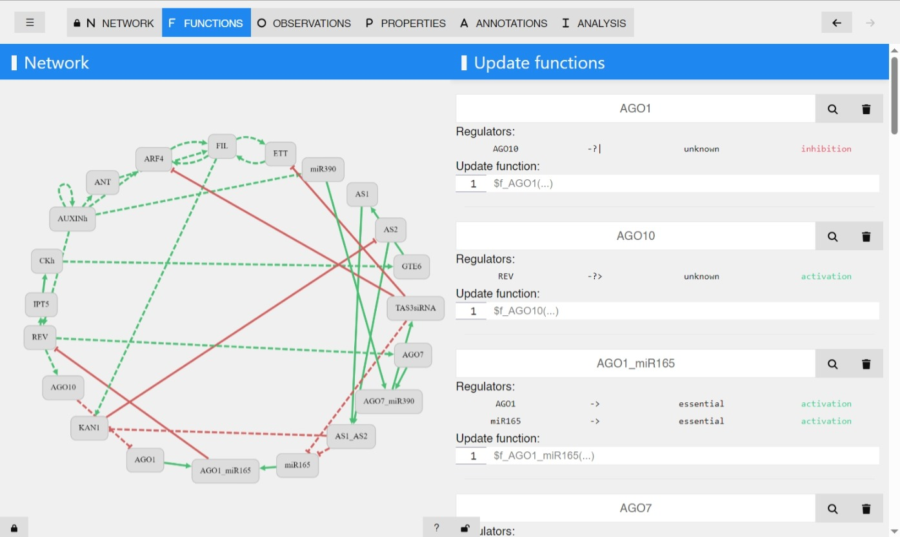

# Boolean Network Sketches: A Unifying Framework for Logical Model Inference

This is a small Rust library focusing on logical model inference through Boolean network sketches, as described in our Bioinformatics [paper](https://doi.org/10.1093/bioinformatics/btad158). 
This repository includes a prototype implementation of the framework, alongside benchmark models and data used for experiments and case studies.
**See the following section on Sketchbook**, a production-ready desktop tool that fully implements our BN inference method.

This readme describes the repository contents and also contains instructions on how to replicate the main experimental results of the paper.
The whole repository is available at [github](https://github.com/sybila/boolean-network-sketches), as well as at [zenodo](https://doi.org/10.5281/zenodo.7688740).

> Also note that this repository currently contains an updated version of the original prototype. The initial release corresponding to the artefact of the paper can be downloaded [here](https://github.com/sybila/boolean-network-sketches/releases/tag/v0.1.0). The assets contain original source code, benchmarks, and correspoding setup instructions.

### Use our new tool Sketchbook!

This repository contains a prototype version of the Boolean Network Sketches framework, developed in 2022.
Since then, we’ve implemented the full inference method in a production-ready desktop tool, called **Sketchbook**.
Sketchbook features a user-friendly graphical interface for designing Boolean network sketches and computing all admissible BNs.
You can find the latest version of Sketchbook at [this Github repository](https://github.com/sybila/biodivine-sketchbook). See the example screenshot below for an illustration of the interface:




## Setup

To run the experiments in this repository, you will need the Rust compiler.
We recommend following the official instructions at [rustlang.org](https://www.rust-lang.org/learn/get-started) (default configuration should be sufficient) instead of using a package manager. 
However, either method should work fine.
When using the official installer, everything is stored in `~/.cargo`, so admin privileges are not necessary.
The current version of the repository was tested with Rust `1.64` (April 2025).
Rust will automatically download and cache all other libraries necessary to compile the project.
You should therefore have internet access while running the commands for the first time.
You can force rust do download all dependencies by running `cargo fetch`.


## Running the Inference Process

### Boolean network sketch

Boolean network sketch represents a combination of prior knowledge, experimental data, and hypotheses regarding the modelled system.
BN sketch is given by the following components:
- influence graph
- partially specified Boolean network
- properties of update functions
- dynamic properties of the system

### Input format

The input for the analysis is an [AEON model](https://biodivine.fi.muni.cz/aeon) annotated with HCTL formulas.

The intuitive aeon model format (details [here](https://biodivine.fi.muni.cz/aeon/aeon-manual.pdf)) covers the first three components of the sketch.
To get familar with AEON models, we recommend [this page](https://biodivine.fi.muni.cz/aeon/manual/v0.4.0/model_editor/import_export.html) 
of the AEON manual. A wide range of real-world models for testing can be also found
[here](https://github.com/sybila/biodivine-boolean-models) (however, these models do not contain any HCTL formulas).

The dynamic properties are given by HCTL formulas.
The details of the HCTL syntax can be found [here](https://github.com/sybila/biodivine-hctl-model-checker).
Note that several types of formulae can be generated from data on the run (via utilities provided in `src/data_processing/data_encoding.rs`).
You can add a *named dynamic property* by annotating the model with a line in the following format:
```
#! dynamic_property: NAME: #`HCTL_FORMULA`#
```

Below, we show a simple example of how to include assertions and properties in a model file (we intentionally
limit the use of hybrid operators to simplify the example). 

```
# This property `reach_apoptosis` states that every state must be able to reach a state where
# variable `Apoptosis` is true. `#!` is used to start a "comment annotation"
# The #` and `# serve as opening/closing escape characters for the HCTL formula.
#! dynamic_property: reach_apoptosis: #`EF Apoptosis`#

# Property `will_die` states that the system will always eventually reach `Apoptosis`.
#! dynamic_property: will_die: #`AF AG Apoptosis`#

# Property `cannot_be_undead` states that whenever `Apoptosis` is true, it must
# stay true forver.
#! dynamic_property: cannot_be_undead: #`Apoptosis => AG Apoptosis`#
```

Example of such annotated model is given in `benchmark_models/annotated_tlgl.aeon`.
Note that the example formulae can be generated automatically, as shown in our case study.
We are currently working on adding automatic encoding for various kinds of datasets directly to the inference program.

### Running the Inference 

To run the general inference process (code in `src/main.rs`), compile the program first using `cargo build --release`
and then run it as
```
.\target\release\sketches-inference [OPTIONS] <MODEL_PATH>
```
- `MODEL_PATH` must point a file with a valid sketch model (as described above)

For example, you may try running the inference on the provided TLGL model:
```
.\target\release\sketches-inference .\benchmark_models\annotated_tlgl.aeon
```

The program runs the inference, prints details regarding the computation progress and, once finished, shortly summarizes the results (how many satisfying BNs there are).

By providing additional `OPTIONS` (CLI arguments), you can receive more detailed output.
This enables, for example, to generate witness networks or summarize update functions of the satisfying BNs.
To see the details regarding program's optional arguments, you can run 
```
.\target\release\sketches-inference --help
```

See the section `Benchmarks and Evaluation` below on how to run more specialized inference cases,
such as inference from attractor data. Note that everything can be run using the general inference script. 
However, the specialized methods might provide further optimizations or simpler user interface.

## Benchmarks and Evaluation

Here we describe how to execute the experiments described in the paper.
You can either use prepared Bash wrapper scripts to re-run the experiments, or run them directly by compiling and executing the Rust binaries.

### Requirements and Dependencies

We recommend to run the benchmarks on a machine with at least 16GB RAM. 
Otherwise, the largest benchmarks (models with 100+ variables) may take a long time to evaluate (however, even with less memory, it should be fine to run the code regarding both case studies or smaller benchmarks). 
All displayed computation times were acquired on a standard laptop with an 11th Gen Intel i5 CPU and 16GB RAM.

Follow the instructions in section `Setup` to install the Rust compiler.
Once you are done with the experimenting, you can uninstall the compiler by running `rustup self uninstall`.

For convenience, we have prepared Bash or Python scripts to wrap all the commands needed. If you want to use the scripts, you will need a Unix-based system with Bash. 
On Windows, it should be sufficient to use [WSL](https://learn.microsoft.com/en-us/windows/wsl/install) (we have tested the Ubuntu-20.04 WSL). 
However, note that these scripts are not needed, as you can execute the Rust code directly (as described below).

### Benchmark Models and Pre-Computed Raw Results

All the models used for the evaluation (and some more) are in the `benchmark_models` directory. 
Each model has its own subdirectory.

Models used for the case studies are in the sub-folders `case_study_TLGL` and `case_study_arabidopsis`.
These sub-folders contain all the model variants in aeon format, encoded attractor states, and metadata. 
They also contain files with the raw outputs from corresponding binaries and summarization of update functions of resulting candidates.

The running example from the paper is in the `small_example` subdirectory. 
There is the starting aeon model, the HCTL formulae used, and the results (including the single consistent network).

The sub-folders with models used for scalability evaluation contain four files each:
- `model_concrete.aeon` - a fully specified model with which we started
- `model_parametrized.aeon` - a parametrized version of the same model, used for the sketch
- `attractor_states.txt` - a collection of encoded synthetic attractor data
- `results.txt` - resulting output from the corresponding binary (see below)
- `metadata.txt` - links to the model's original source and publication

### Running Experiments Through Prepared Scripts

We have prepared four Bash scripts which encompass the compilation and execution of the underlying Rust code.
Scripts `run_case_study_1.sh` and `run_case_study_2.sh` run the corresponding case studies - for each case study, two computations are executed, corresponding to the two respective sketch variants from the paper.
To execute the evaluation of all scalability benchmarks one by one, use `run_scalability_benchmarks.sh`.
The all-encompassing script `run_all_experiments.sh` runs all these experiments (both case studies and all benchmarks), one after another.
Each script prints the result summarization and all the relevant progress on the standard output.
Scripts can be executed for example as:

```
bash ./run_case_study_1.sh
bash ./run_case_study_2.sh
bash ./run_scalability_benchmarks.sh
bash ./run_all_experiments.sh
```

The scripts should work on any classical Unix-based system, and we have also tested them on Windows Subsystem for Linux (WSL), particularly on the Ubuntu distribution.
If you have a Unix-based system but have a problem running Bash scripts, you can try the Python version of the encompassing script (you will need a Python 3).

```
python3 run_all_experiments.py
```

### Running Individual Experiments Directly

To directly re-run individual benchmarks or case studies, compile the code first with `cargo build --release` (on Windows, we recommend using Powershell 5+ to run the experiments).

The Rust code regarding the two case studies from the paper can be found in `src/bin/` folder (particularly, `case_study_arabidopsis.rs` and `case_study_tlgl.rs`). 
The resulting binaries will be in `target/release/`. 
Note that on Windows, the path is usually `target\release\` and binaries have `.exe` suffix. 

Each case study consists of two parts - one regarding the initial version of the sketch, and the other regarding the refined (modified) variant of the sketch. 
You can choose the desired variant using an option, as shown below.
To re-run the desired variant, execute one of following binaries either with or without the option:

```
./target/release/case-study-tlgl [--refined-sketch-variant] 
./target/release/case-study-arabidopsis [--modified-sketch-variant]
```

To run the experiments regarding scalability, use the following binary.
It is a general method for the inference using network sketches with attractor data, so you can choose an arbitrary model. 

````
./target/release/inference-with-attractors [OPTIONS] <MODEL_PATH> <ATTRACTOR_DATA_PATH>
````
- `MODEL_PATH` is a path to a file with a parametrized model in aeon format
- `ATTRACTOR_DATA_PATH` is a path to a file with attractor data (one encoded state per line)

You do not need to add any options to replicate the experimental results, but if you want to know more, use:
````
./target/release/inference-with-attractors -h
````

### Tests 
To run the test suite, use `cargo test` command.

## Availability

This repository with the artefact is available on [Github](https://github.com/sybila/boolean-network-sketches) and also at [zenodo](https://doi.org/10.5281/zenodo.7688740).

The implementation is based mainly on two of our Rust libraries:
- [biodivine-hctl-model-checker](https://github.com/sybila/biodivine-hctl-model-checker) for the underlying symbolic coloured model checking
- [biodivine-lib-param-bn](https://github.com/sybila/biodivine-lib-param-bn) which facilitate the symbolic encoding of Boolean networks

The implementation itself is fairly minimal (includes i.e., high-level framework or encoding of dynamic properties) and contains basic comments that explain the function of individual components.

Everything is open-source and available with the permissive MIT License.

You can find the latest version of our desktop inference tool Sketchbook at [this Github repository](https://github.com/sybila/biodivine-sketchbook), as described above.
To visualize and modify the partially specified BN models (aeon files) included in this repository, you can also use the online interface of our tool [AEON](https://biodivine.fi.muni.cz/aeon). This tool can also be used to further analyse the attractors of Boolean network models.
